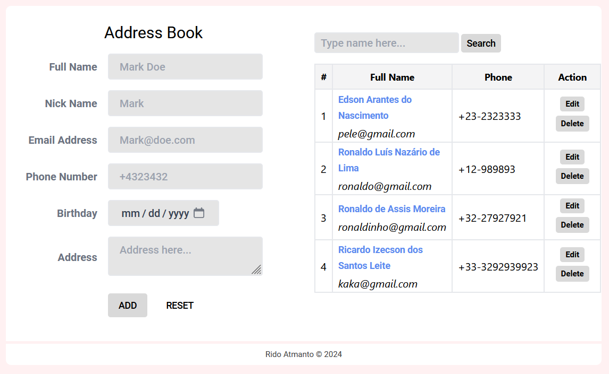

# Address Book

Here's the code for address-book management with JavaScript.

## Projects

- Address Book Demo URL [https://address-book.ridoatmanto.com](https://address-book.ridoatmanto.com/)



## Contacts

- Telegram [https://t.me/ridoatmanto](https://t.me/ridoatmanto)
- [Gmail](https://gmail.com)
- [Twitter](https://twitter.com/ridoatmanto)

```
This project is introduce data display manipulation in JavaScript without any database.
```

Created &copy; 2024 &middot; Rido Atmanto.
